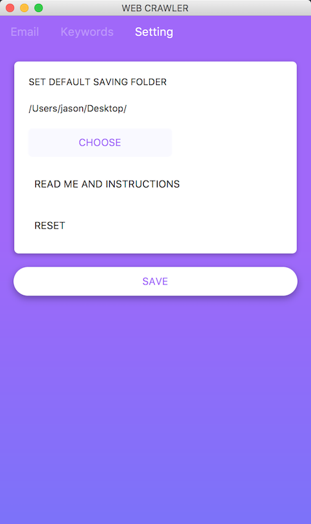

# Email Crawler

*The email crawler is a modern designed GUI crawler to batch fetch useful infomation on the website. Not only for emails but other keywords are also supported.*

## Usage

This project is developed in java, which need jvm installed. JRE [Download here](https://www.java.com/en/download/manual.jsp) and select the right package.

### Kick it start:

##### For windows:

Double click the file named `start from here.bat`, It will call a black window out and a GUI software followed.

##### For Mac and linux:

just double click the jar file named `crawler_main.jar`(might varied in different version).

### Make it work:

 It contains 3 sections of function zone.

#### Email crawler
 
 
 
#### Keyword crawler 
 
 
 
#### Email Setting
 
 

## FAQ

## Roadmap

See the [open issues](https://github.com/pages-themes/cayman/issues) for a list of proposed features (and known issues).

## Project philosophy

email crawler is intended to make those people who need to find information's life easier. Thanks a lot to my friend *Li xu*, who strongly supported and supporting on this project. It should look great, but that goes without saying.

## Contributing

Interested in contributing? We'd love your help. Cayman is an open source project, built one contribution at a time by users like you. See [the CONTRIBUTING file](CONTRIBUTING.md) for instructions on how to contribute.

## Contact infomation

If you have any further question, please feel free to mail me or add my wechat `Zhou_zhengchang`.
