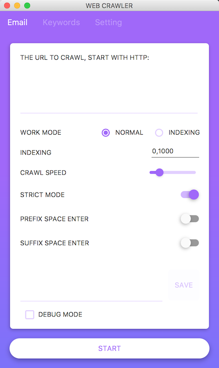
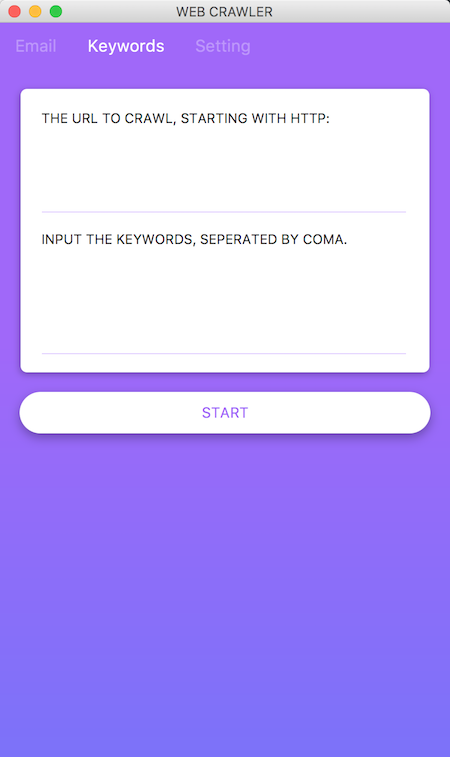

# Email Crawler

*The email crawler is a modern designed GUI crawler for batch fetching useful infomation on the website. Not only for emails but other keywords are also supported.*

## Usage

This project is developed in java, which need jvm installed. JRE [Download here](https://www.java.com/en/download/manual.jsp) and select the right package.

### Kick to start

Note that unzip is always the first step after the zip package has been downloaded.

##### For Windows:

Double click the file named `start_from_here.bat`, It will call a black window out and a GUI software will be opened then.

##### For Mac and linux:

Double click the jar file named `crawler_main.jar`(might vary in different version).

### Make it work:

 It contains 3 sections of function zone.

#### Email crawler
 
 
 
 1. Type in the root url or it's links which contains the email info mation.
 2. The url is 2 types: normal type and indexing. normal one is normal as it is. The indexing url is like `http://abc.com/web?studentpage=1`. The number `1` could be replaced by other number and then we can see the other pages there. the max number is always shown on the page.
 3. Crawl speed is the thread number of crawling. Under 100 is safe, while over that value might lead to lagging.
 4.  The inner hyper link will never be fetched so that `strict mode` is very useful for speed up crawling. But if you need to crawl links in the web page, the crawling mode should be closed.
 5. prefix and sufix space and enter is recommonded commonly. This will avoid some common problems which might lead to crawling failure.
 6. The replacement area is the key feature in the software. You can customize keyword to crawl revealed great extention ablity. In some web page `@` is replaced by `[@]`, `[#]`, etc to avoid crawling, but here we can use this feature to replace the `@`. Just type in the keywords even `@` image: `[@],[#],<image='./at.jpeg'>` seperated by comma, all these email types can be recorded well.
 7. Debug mode is for mac, windows can see the debug infomation on the black concle.
 
#### Keyword crawler 
 
 
 
#### Email Setting
 
 
 
 1. Select the place to save ur file!
 2. Read me contains EVEY IMPORTANT information, please go through it.
 3. Don't forget to press save!
 
The email(or anything you like if keyword is customized) will be generated on the Desktop(as default, you can change the directory in setting) with a the website’s url and a path extention `.csv.` e.g. `baidu.com.csv`.
This fill could be opened by excel(or some other supported office software).

[How to read the file.csv with column and lines on excel in Windows](http://jingyan.baidu.com/article/76a7e409bf9a3ffc3b6e1535.html)

## FAQ

## Roadmap

See the [open issues](https://github.com/pages-themes/cayman/issues) for a list of proposed features (and known issues).

## Project philosophy

email crawler is intended to make those people who need to find information's life easier. Thanks a lot to my friend *Li xu*, who strongly supported and supporting on this project. It should look great, but that goes without saying.

## Contributing

Interested in contributing? We'd love your help. Cayman is an open source project, built one contribution at a time by users like you. See [the CONTRIBUTING file](CONTRIBUTING.md) for instructions on how to contribute.

## Contact infomation

If you have any further question, please feel free to mail me or add my wechat `Zhou_zhengchang`.
